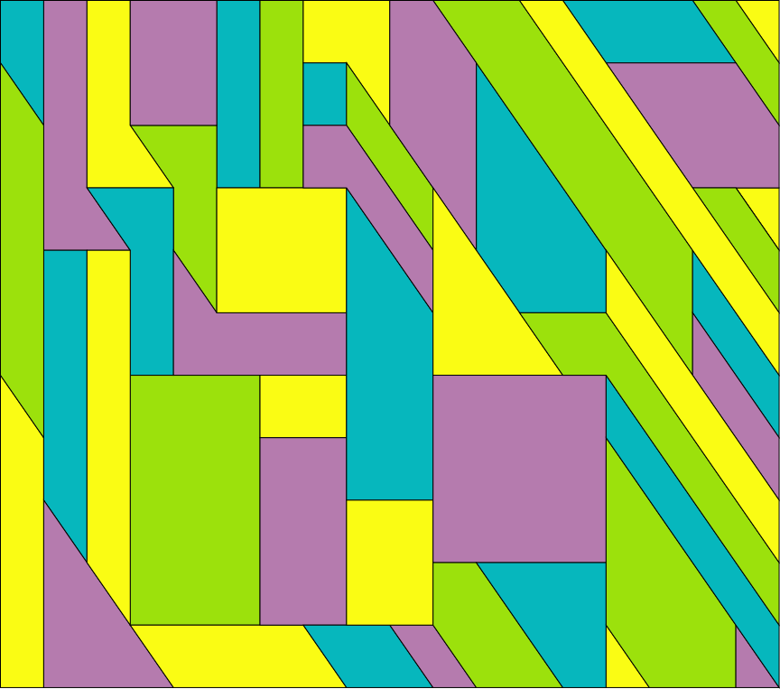
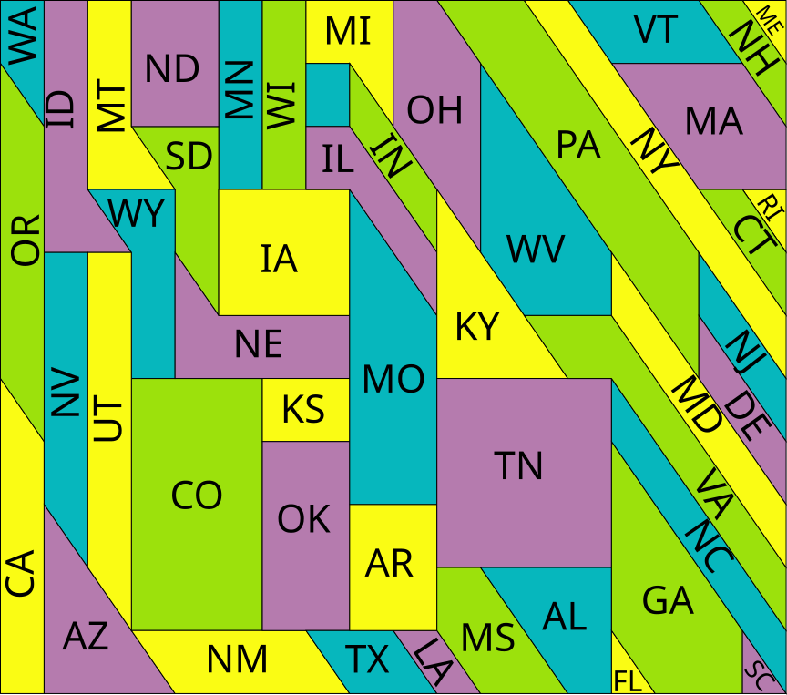

A vectorized version of Sian Zelbo's [original painting].

If you open in inkscape, you can set hidden layers to visible to see state labels.

Posted with permission from the author.

Example output:

[original painting]: https://www.1001mathproblems.com/2015/11/topologists-map-of-united-states-to.html
